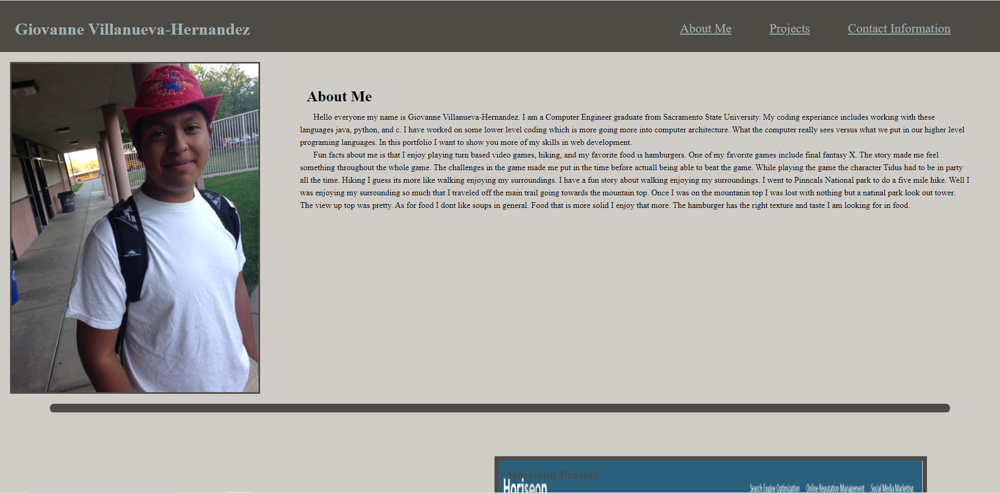
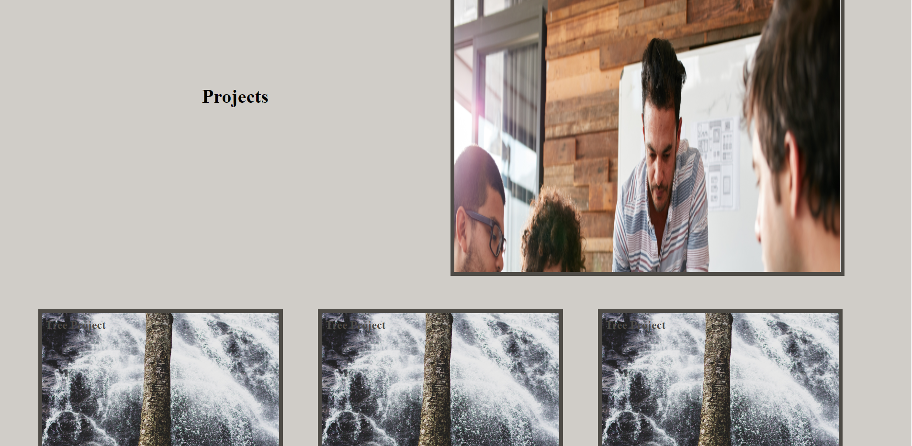
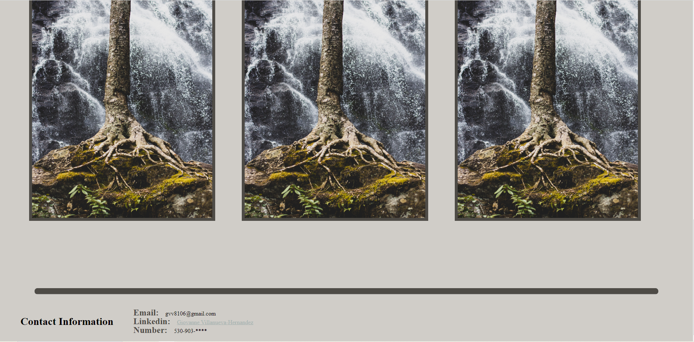
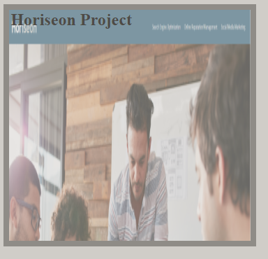

# Giovanne_Portfolio

# Description

I have been learning html and css for a while now, gaining confidence in myself. The confidence I have gained lead me to work on a website on my own to display these skills I have aquired through my study. A portfolio is a great way to display these skills. I can show this project along with other ones I have tackled. In this portfolio I will be specifically showing more css skills like flexbox, @media, and pseudo-classes. The biggest help in this project was w3schools and mdn web documents. The resources I found helped me work through problems I had. By the end of the projects I understood the box model better. The reason why is because I had to move items on the page and control the size it takes. Without this box model idea I would not have been able to move items on the webpage. Then understanding different styling like object fit, flex basis, and seeing how the different text sizes move items. The next thing I accomplished was to give certain elements in the html certain properties like transtioning from clear picture to an image that is fadeing. Pseudo classes lets us interact with the portfolio website to make the transition possible.

# Installation
 
 N/A

 # Usage

 The purpose of the webpage was to demenstrate my skills with html and css, along with leading users to other projects I have worked on. I have an index html with the basic html without javascript. The html file is linked to two css files one with my styling and the other one is a reset (A style sheet with basic css we expect without any special styling I will add). Also the html is not fully accessiblity friendly, improvements can be made in that aspect. There are three different section in the body of this html file. Images are included in the html file along with links to my other work. The links include the navagation bar on the top to access different parts of the webpage faster. Then the images in the projects section are clickable and they take you to the project. The last link is in the contact information section it is my name witch takes you to my linkedin page. I have only included one project I have done for now. The other projects in the projects section is just an image of a tree I liked and if you have noticed from the screen shots I took of the webpage, The webpage is tring to follow a color scheme that is matching the tree image. 

Enough about the html moving on to the css you can expect to see most items are inside a flex box. I used a flex box for the styling because it moves and changes with the webpage. I do not have to account for every specific screen size. I used different parts of flex to make the webpage like flex basis, flex direction, flex warp, justify content, and align items. Some special css I included was the pseudo class for the images. The specific pseudo class used was hover so if I hover over an element it will execute what css I have inside. All the names in the css are the classes and (id)s defined in the html file this is how I style sections differently. Last notiable thing about the css is the @media at the very bottom to account for different sizes, so the styling on the webpage will change depending on the screen size. 

# Credits

Thank you UC Davis BootCamp for providing the reset.css I used in the project

Thank you w3school and mdn web doc for providing information on flexbox and other CSS styling I used

# License

PLease refer to the license in repo